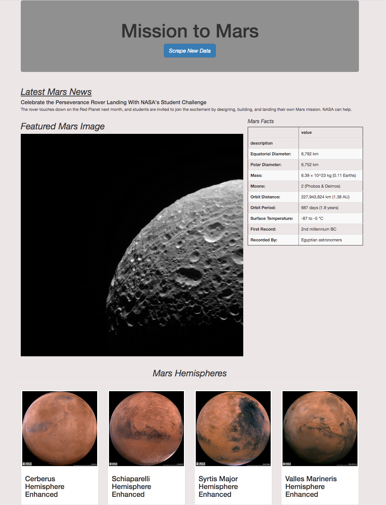

# **Mission-to-Mars**  

## **Overview of Project**
This is web scraping project to retrieve data from different websites and using that data to create a new webpage.

### **Project Summary**

The project consists of two parts:

1. First using python and its libraries(to create an automated scraping process), data was retrieved from three websites and stored in a MongoDB database (as the data is unstructured). this data contains information about planet Mars(articles, images and tables).

&nbsp;

2. Then, using HTML and Flask, a new responsive webpage was created by connecting to the MongoDB database and feeding the data into the HTML code. in order to being able to update the data on the page we added a button to scrape new data by calling the code we wrote for scraping in the first part and updating the data in the database.
Here is a screenshot of the created webpage:

&nbsp;

